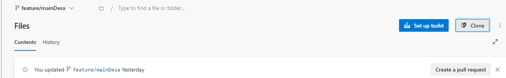
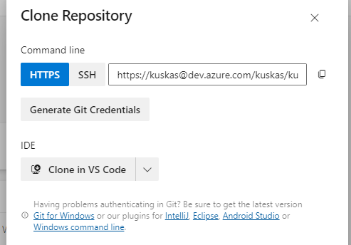

# 🧪 Helm Chart Debugging Templates usando librerias en ACR
En este documento se revisara el paso a paso de como debuguear un helm chart usando librerias alojadas en el ``azure container registry`` 

## Prerrequisitos

- Azure CLI instalado y configurado.
- Cuenta de Azure con permisos suficientes.
- Helm instalado (versión 3.0 o superior).

## Paso 1: Descargar repositorio helm chart 
1. **Obtener el link de clonado:** Ve a tu plataforma de repositorio favorita (en esta ocasión se usara ``Azure repos``) y clona tu proyecto.

    
    
    
2. **Clonar repositorio:**
   ```bash
   git clone https://kuskas@dev.azure.com/kuskas/kuskasChar2/_git/apps.services.config
   ```
    Esto creará un directorio ``dope-library`` con una estructura básica de un Helm Chart.

3. **Ingresar al directorio donde se clono el repo:**
   ```bash
        cd apps.services.config
        ls
   ```
    -> Resultado sol de ejemplo
   ```log
           Mode                 LastWriteTime         Length Name
        ----                 -------------         ------ ----
        d-----        30/05/2024     16:17                argoscd
        d-----        30/05/2024     16:17                capa-kuska
        -a----        30/05/2024     16:17            985 README.md
   ```
   ya con esto realizamos navegamos hasta el directorio ``capa-Kuska``.

4. **Ejecutamos comando de debugging ``primer intento``**
   ```bash
        helm install jira ./JIRA/helm --dry-run --debug -f ./JIRA/helm/values-dev.yaml

   ```
   -> Posible error
   ```log   
        Error: INSTALLATION FAILED: An error occurred while checking for chart dependencies. You may need to run `helm dependency build` to fetch 
        missing dependencies: found in Chart.yaml, but missing in charts/ directory: microservice-library-chart, dope-ingress
        helm.go:84: [debug] found in Chart.yaml, but missing in charts/ directory: microservice-library-chart, dope-ingress
        helm.sh/helm/v3/pkg/action.CheckDependencies
   ```
5. **Ejecutamos comando de instalación de dependencias ``primer intento``**

   ```bash
        helm dependency build
    ```
    -> Posibles errores 
    ```log
        Error: no repository definition for cicddevops.azurecr.io/helm/microservice-library-chart, cicddevops.azurecr.io/helm/dope-ingress. Pleaseadd them via 'helm repo add'
        Note that repositories must be URLs or aliases. For example, to refer to the "example"
        repository, use "https://charts.example.com/" or "@example" instead of "example". Don't forget to add the repo, too ('helm repo add').
    ```

5. **Damos la solución al error anterior**
    ```bash
        cd capa-kuska/JIRA/helm

        ls
    ```
    -> Resultado sol de ejemplo
    ```log
            Mode                 LastWriteTime         Length Name
        ----                 -------------         ------ ----
        d-----        30/05/2024     16:57                charts
        d-----        30/05/2024     16:17                templates
        -a----        30/05/2024     16:57            325 Chart.lock
        -a----        30/05/2024     16:56            399 Chart.yaml
        -a----        30/05/2024     17:07           2451 values-dev.yaml
        -a----        30/05/2024     16:17           2333 values-prod.yaml
        -a----        30/05/2024     16:17           2199 values-qa.yaml
        -a----        30/05/2024     16:17            164 values.yaml
    ```
    -> De esta manera es incorrecta la forma de usar ``dependencies``
    ```yaml
        apiVersion: v2
        name: test-pipelines-java
        version: 1.0.0
        appVersion: 0.0.3-SNAPSHOT
        description: A Helm chart for Microservices 

        dependencies:
        - name: microservice-library-chart
        version: "1.2.4"
        repository: "cicddevops.azurecr.io/helm/microservice-library-chart"
        - name: dope-ingress
        version: "0.2.8"
        repository: "cicddevops.azurecr.io/helm/dope-ingress"
    ```
    -> Esta es la forma correcta de usar ``dependencies``
    ```yaml
        dependencies:
        - name: microservice-library-chart
        version: "1.2.4"
        repository: "oci://cicddevops.azurecr.io/helm"
        - name: dope-ingress
        version: "0.2.8"
        repository: "oci://cicddevops.azurecr.io/helm"
    ```
6. **Ejecutamos comando de instalación de dependencias ``segundo intento``**

   ```bash
        helm dependency build
    ```

    -> Posible log de resultado:

    ```log
        Hang tight while we grab the latest from your chart repositories...
        ...Successfully got an update from the "aad-pod-identity" chart repository
        ...Successfully got an update from the "chartmuseum" chart repository
        ...Successfully got an update from the "bitnami" chart repository
        Update Complete. ⎈Happy Helming!⎈
        Saving 2 charts
        Downloading microservice-library-chart from repo oci://cicddevops.azurecr.io/helm
        Pulled: cicddevops.azurecr.io/helm/microservice-library-chart:1.2.4
        Digest: sha256:f853a65538b397e3c8fbbca6f9149daeb31ae0883849c486c8e233ef2ca3f1e4
        Downloading dope-ingress from repo oci://cicddevops.azurecr.io/helm
        Pulled: cicddevops.azurecr.io/helm/dope-ingress:0.2.8
        Digest: sha256:9495ce4e345a30a813897f8080a57ba9db96bf32ba05ba09240d9cf6889f7861
        Deleting outdated charts
    ```
7. **Ejecutamos comando de debugging**
   ```bash
        helm install jira ./JIRA/helm --dry-run --debug -f ./JIRA/helm/values-dev.yaml
   ```
   
