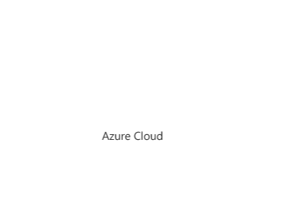

# Estructura General

<center>
    
</center>

---
   ```bash
        <entorno>-<capa>-<tipo_recurso>-<nombre_servicio>
   ```

## Lista Detallada de Recursos

### Entorno (ambiente):

- adesa: Desarrollo
- qa: Pruebas
- aprod: Producción
- landzone: Zona de aterrizaje (Landzone)

    #### Ejemplo: adesa, qa, aprod, landzone

### Capa:

- capa kuska
- capa comun

#### Ejemplo: kuska, comun

### Tipo de Recurso (abreviatura del tipo de servicio):

- rg: Resource Group
- vnet: Virtual Network
- vm: Virtual Machine
- app: App Service
- sql: SQL Database
- stor: Storage Account (sólo letras minúsculas y números, sin guiones ni guiones - bajos)
- acr: Azure Container Registry (sólo letras minúsculas y números, sin guiones ni - guiones bajos)
- aks: Azure Kubernetes Service
- apim: API Management
- func: Function App
- log: Log Analytics Workspace
- appgw: Application Gateway
- nsg: Network Security Group
- pip: Public IP Address
- lb: Load Balancer
- redis: Redis Cache
- kv: Key Vault
- cosmos: Cosmos DB
- eh: Event Hub
- sb: Service Bus
- iothub: IoT Hub
- cdn: CDN Profile
- ai: Application Insights
- ci: Cognitive Services
- sf: Service Fabric

### Nombre del Servicio:

Nombre breve descriptivo que resuma el propósito del recurso.

#### Ejemplo: 
- backend
- db
- web
- frontend
- auth
- apis

### Ejemplos de Nombres para Diferentes Recursos
1. Grupo de recursos para producción en la capa kuska:

```bash
    aprod-kuska-rg
```

2. Azure Container Registry en desarrollo para la capa común:

```bash
    adesacapacomunacr
```

3. API Management en entorno de pruebas para la capa kuska:

```bash
    qa-kuska-apim-apis
```

4. Azure Kubernetes Service en producción para la capa kuska:

```bash
    aprod-kuska-aks-cluster
```

### Observaciones
- Restricciones de Caracteres: Algunos recursos como Storage Account y Azure Container Registry solo permiten letras minúsculas y números, por lo que es importante evitar guiones - y guiones bajos _ en estos nombres.

- Coherencia: Mantener la coherencia en los nombres es clave para facilitar la administración y el mantenimiento de los recursos.

- Longitud: Asegúrate de revisar las limitaciones de longitud y caracteres permitidos para cada tipo de recurso en Azure.

---
