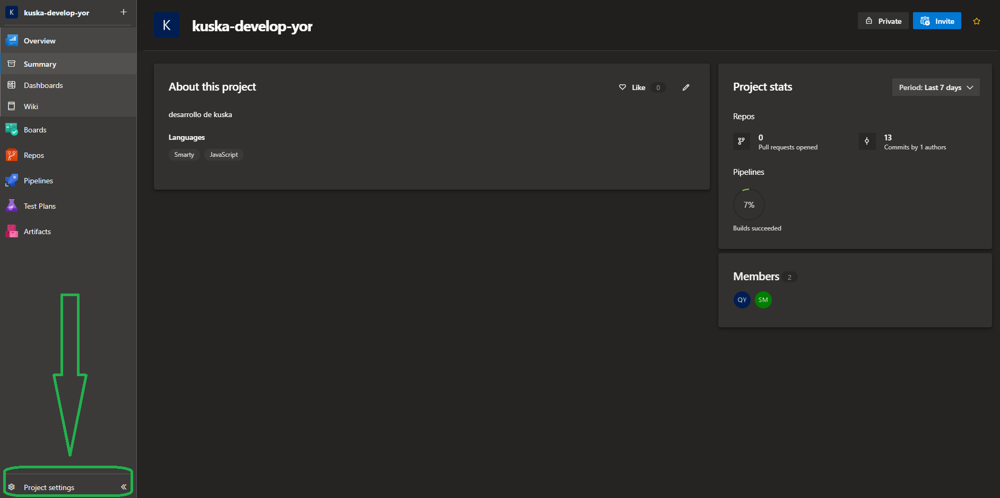
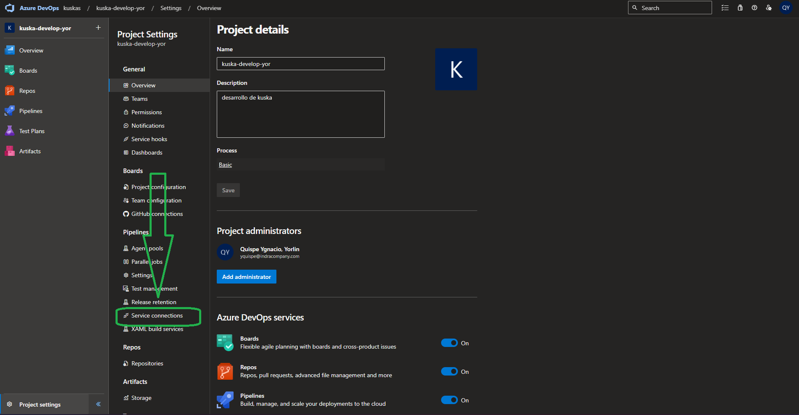
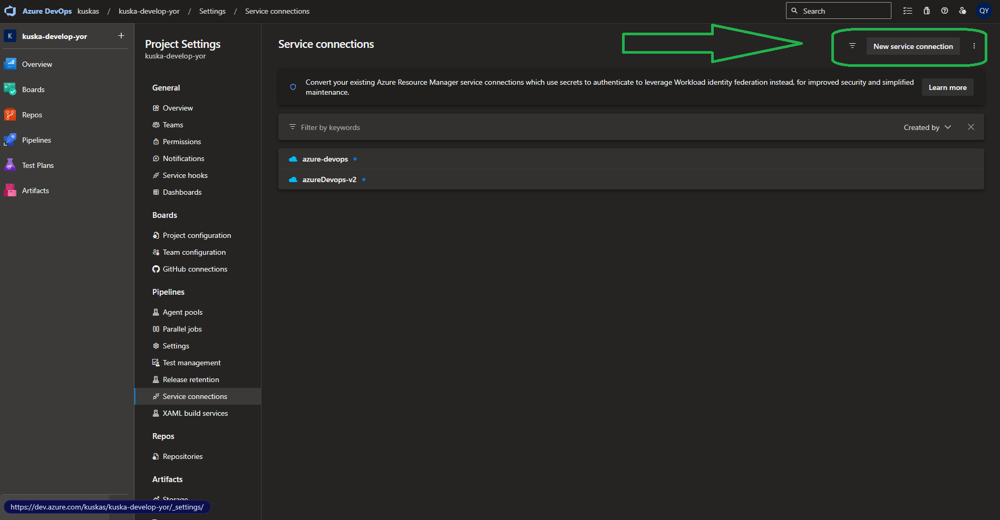
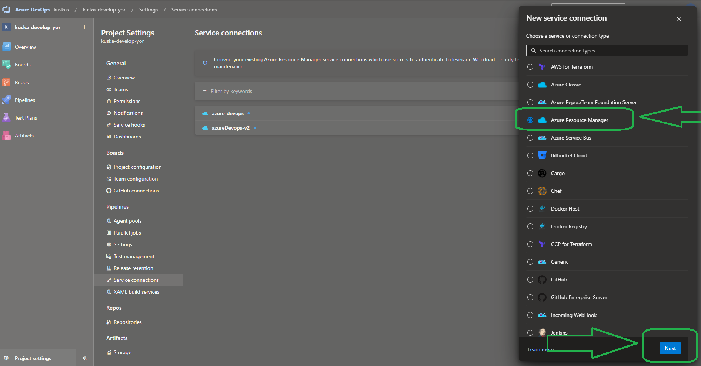
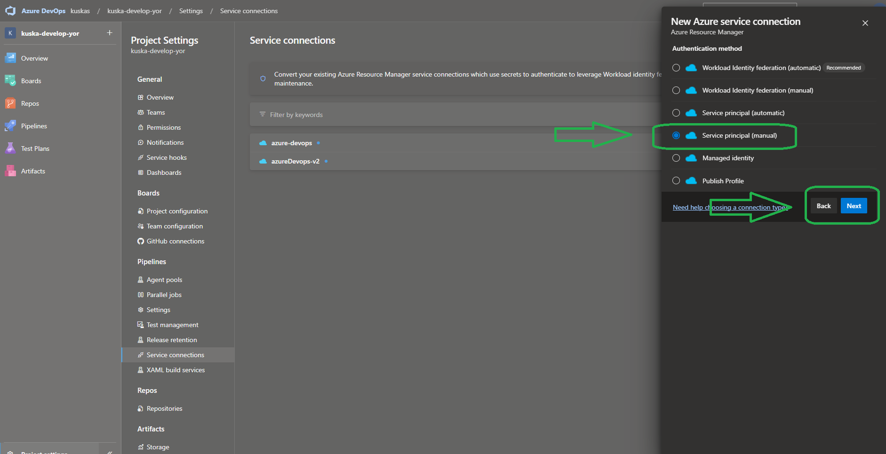
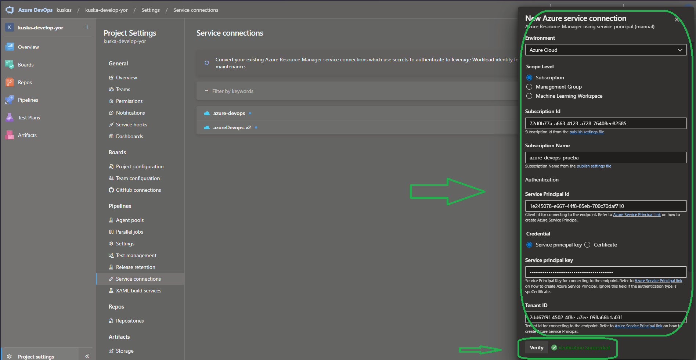
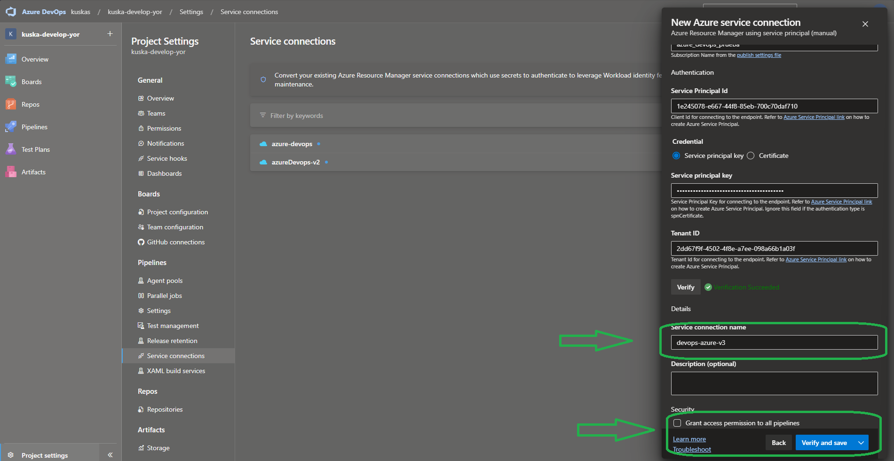
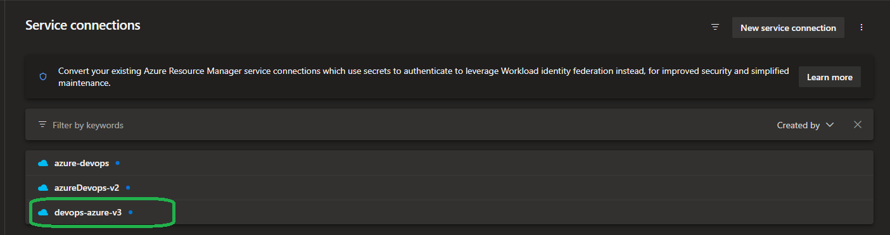
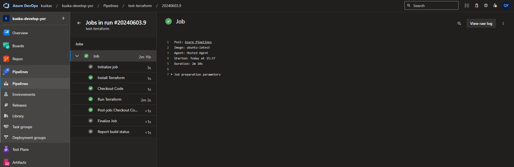

# ☁️ Configuración y puesta en marcha de Service Conection aplicado para 🌏 Terraform
En este documento se revisara el paso a paso configuración y puesta en marca de una Service Conection para IAC con Terraform

## Prerrequisitos

- Azure CLI instalado y configurado.
- Cuenta de Azure con permisos suficientes.


## Paso 1: Configurar Azure CLI 💻
1. **Loguearse en Azure CLI:** 
    ```bash
        az login
    ```
    -> Esta es el posible log resultante una vez culmines el logueo
    ```log
        Please select the account you want to log in with.

        Retrieving tenants and subscriptions for the selection...

        [Tenant and subscription selection]

        No     Subscription name    Subscription ID                       Tenant
        -----  -------------------  ------------------------------------  -----------------
        [1] *  azure_devops_prueba  72d0b77a-a663-4123-a728-xxxxxxxxxxxx  Default Directory

        The default is marked with an *; the default tenant is 'Default Directory' and subscription is 'azure_devops_prueba' (72d0b77a-a663-4123-a728-xxxxxxxxxxxx).

        Select a subscription and tenant (Type a number or Enter for no changes):

        Tenant: Default Directory
        Subscription: azure_devops_prueba (72d0b77a-a663-4123-a728-xxxxxxxxxxxx)

        [Announcements]
        With the new Azure CLI login experience, you can select the subscription you want to use more easily. Learn more about it and its configuration at https://go.microsoft.com/fwlink/?linkid=2271236

        If you encounter any problem, please open an issue at https://aka.ms/azclibug
    ```
2. **Creacion de Service principal mediante la CLI:**
    ```bash
        az ad sp create-for-rbac --name "azureDevops-v3"
    ```
    -> Esta es el posible log resultante una vez culmines la creacion del Service principal
    ```json
        {
            "appId": "1e245078-e667-xxxx-85eb-xxxxxxxxxxxx",
            "displayName": "azureDevops-v3",
            "password": "xxxxx~LOhXRQHfaTWxxxxGiTsmn3-G.xxxxx.D",
            "tenant": "2dd67f9f-xxxx-4f8e-a7ee-xxxxxxxxxx"
        }
    ```
3. **Asingnación de roles al Service principal:**
    ```bash
        az role assignment create --assignee <Service principal ID> --role Owner --scope /subscriptions/<subscriptions ID>
    ```
    -> Esta es el posible log resultante una vez culmines la asignacion de roles al Service principal

    >El rol asignado es segun tu necesidad, puede ser Owner o Reader

    ```json
        {
        "condition": null,
        "conditionVersion": null,
        "createdBy": null,
        "createdOn": "2024-06-03T20:35:34.032641+00:00",
        "delegatedManagedIdentityResourceId": null,
        "description": null,
        "id": "/subscriptions/72d0b77a-a663-xxxx-a728-xxxxxxxxxxxx/providers/Microsoft.Authorization/roleAssignments/543a96a2-0e6d-4303-xxxx-xxxxxxxxxxxx",
        "name": "543a96a2-xxxx-4303-ae86-xxxxxxxxxxxx",
        "principalId": "1e245078-e667-xxxx-85eb-xxxxxxxxxxxx",
        "principalType": "ServicePrincipal",
        "roleDefinitionId": "/subscriptions/72d0b77a-a663-xxxx-a728-xxxxxxxxxxxx/providers/Microsoft.Authorization/roleDefinitions/8e3af657-a8ff-443c-a75c-2fe8c4bcb635",
        "scope": "/subscriptions/72d0b77a-a663-xxxx-a728-xxxxxxxxxxxx",
        "type": "Microsoft.Authorization/roleAssignments",
        "updatedBy": "c3778af9-bba8-44b7-9184-xxxxxxxxxxxx",
        "updatedOn": "2024-06-03T20:35:34.306644+00:00"
        }
    ```
## Paso 2: Configurar Azure Devops ♾️
1. **Configurando el Service Conection:**
    
    - Ingresamos a Azure Devops y navegamso al proyecto en el cual deseamos configurar el Service Conection, luego buscamos la seccion de Project Settings
    

    - Buscamos la opcion de Service connection
    

    - Creamos un nuevo Service connection
    

    - Ingresamos seleccionamos la opcion Azure Resource Manager yluego le damos en next
    

    - Seleccionamos Service principal y luego le damos en next
    

    - Completamos los datos para la creacion del Service connection y le damos en verify si sale "verify success"
    
    
    - Asignamos el nombre del Service connection y lo creamos
    

    - Validamos el Service connection
    

## Paso 3: Ejecutar Terraform 🌏
1. **Preparamos el main.tf (ejemplo):**
    ```json
    provider "azurerm" {
        features {}
    }

    resource "azurerm_resource_group" "example" {
        name     = "example-resources"
        location = "West Europe"
    }

    ```

2. **Preparamos el pipeline (ejemplo):**
    ```yaml
        trigger:
        - main

        pool:
        vmImage: 'ubuntu-latest'

        variables:
        azureServiceConnection: 'devops-azure-v3' #usamos el nombre del Service connection que creamos en el paso 1 y 2

        steps:
        - script: |
            wget https://releases.hashicorp.com/terraform/1.0.11/terraform_1.0.11_linux_amd64.zip
            unzip terraform_1.0.11_linux_amd64.zip
            sudo mv terraform /usr/local/bin/
        displayName: 'Install Terraform'

        - checkout: self
        displayName: 'Checkout Code'

        - task: AzureCLI@2
        inputs:
            azureSubscription: $(azureServiceConnection)
            scriptType: 'bash'
            scriptLocation: 'inlineScript'
            inlineScript: |
            terraform init
            terraform apply -auto-approve
        displayName: 'Run Terraform'
    ```
3. **Ejecutar el pipeline (ejemplo):**

    El pipeline deberia ejecutarse de manera autonoma cuando se haga el push a la rama main del repositorio, asi se veria la ejecucion de terraform
    

    